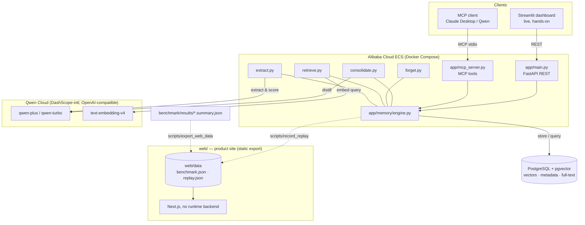

# Tenax Architecture

Export this diagram to `docs/architecture.png` (e.g. paste the Mermaid block into
<https://mermaid.live> and download PNG) and attach it to the Devpost submission.

## Component diagram (Mermaid)

## Why the site has no runtime dependency

`web/` is a static export. Its figures come from `benchmark/results/` and its demo replays
a session captured from a real engine run — both baked in at build time by the generator
scripts. The site therefore renders correctly even when the API, Postgres, and Qwen Cloud
are all unavailable, while still showing nothing but real measured output.

The Streamlit dashboard is the opposite trade and is kept for exactly that reason: it is
the surface where someone can type their own text and watch the memory react live.

## Memory lifecycle

1. **Write** — `remember(text)` → Qwen extracts salient, self-contained statements + type
   + importance → embed with `text-embedding-v4` → store in `memories`.
2. **Read** — `recall(query, budget)` → embed query → hybrid candidate generation
   (vector + full-text) → unified scoring (semantic + keyword + recency + importance) →
   budget-aware packing → reinforce accessed memories.
3. **Forget** — `forget()` → compute decay score per memory → archive those below threshold.
4. **Reflect** — `reflect()` → cluster near-duplicates → Qwen distills each cluster into
   canonical semantic facts → archive sources (`superseded_by`).
